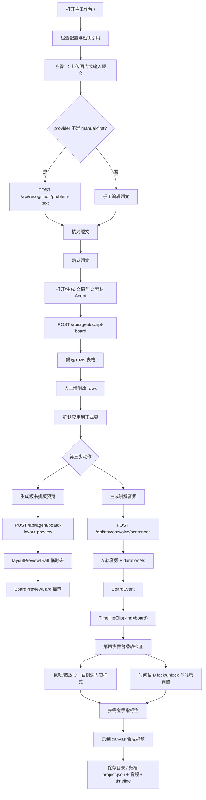
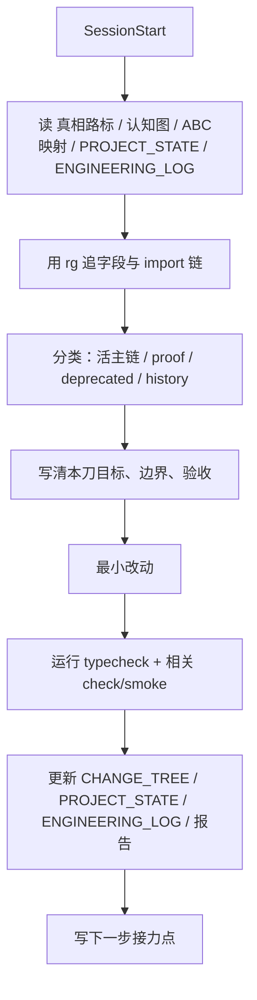

# 2026-06-05 项目 X-ray 扫描报告

> 性质：全仓理解对齐 / 页面-组件-API-SOP 实证报告  
> 范围：根目录核心 MD、`.claude` 状态日志、`src` 主链、服务客户端、Vite 网关、standalone 验证页、关键守门脚本。  
> 验证：`npm run typecheck`、`node scripts/check-abc-architecture.mjs`、`node scripts/check-board-boundaries.mjs` 均通过。

---

## 1. 一句话真相

这个项目不是普通白板，也不是通用画布编辑器。它是一个面向数学题讲解的“直播仿板书录屏工作台”：用户输入题目，Agent 产出讲解切片 rows，A 轨语音作为主时钟，B 轨控制 C 角色何时上台/可选下台，C 角色在舞台上以手写板书方式演绎，最后把底图、C 内容、金手指标注和 A 音频合成为录屏。

作者的设计初衷可以概括为：**让 Agent 只写字段，不碰渲染代码；让舞台只消费上游真相，不重新发明参数。**

---

## 2. 四层目录扫描结论

### 第 1 层：房屋地块

| 区域 | 作用 | 当前判断 |
| --- | --- | --- |
| 根目录 MD | 真相路标、认知图、ABC 映射、代码直敲说明、变更树 | 当前接力入口，必须先读 |
| `src/` | 正式应用源码 | 当前主施工区 |
| `scripts/` | 守门脚本、smoke、网关辅助、Zeabur server | 项目可运行验证的关键证据 |
| `.claude/` | PROJECT_STATE / ENGINEERING_LOG / PROJECT_COGNITION | 接力棒与状态层 |
| `dist/` | 构建产物 | 非源码真相 |
| `历史/` | 历史材料、技能、旧包、归档 | 杂物间，按需证据读取，不作为当前主线 |

### 第 2 层：主体结构

| `src` 子区 | 作用 |
| --- | --- |
| `App.tsx` / `main.tsx` | 页面入口、主 shell、standalone 分发 |
| `components/` | 页面软装与交互组件 |
| `modules/` | 可复用业务内核：ABC、时间线、板书、语音、录制、归档 |
| `services/` | 前端到本地网关的 API 客户端 |
| `store/` | Zustand 唯一运行态状态仓 |
| `domain/` | `TeachingProject` 和 ABC/globalRules 数据真相 |
| `workflow/` | 左侧流程步骤声明 |
| `config/` | 默认配置和运行配置盒 |
| `standalone/` | 单体 proof / prototype 页面 |

### 第 3 层：水电布线

| 业务线 | 文件 |
| --- | --- |
| 题目输入/OCR | `ProblemWorkspace` -> `recognitionGatewayClient` -> `/api/recognition/problem-text` |
| Agent rows | `ScriptAgentWorkspace` / `AgentReviewCard` / `scriptAgentTable` -> `/api/agent/script-board` |
| 排版预览 | `VoiceWorkspace` -> `boardLayoutPreviewGatewayClient` -> `/api/agent/board-layout-preview` -> `BoardPreviewCard` |
| TTS | `VoiceWorkspace` -> `cosyvoiceGatewayClient` -> `/api/tts/cosyvoice/sentences` |
| A/B/C 时间线 | `timeline-factory` -> `applyBoardEventsToTeachingTimeline` -> `TeachingTimeline` |
| C 舞台 | `StagePreview` -> `LegacyStagePreview` -> `DrawboardStage` -> `AutoHandwritingLayer` |
| 录制 | `CanvasRecordingSurface` + C content canvas + `GoldenFingerCanvasLayer` -> `useCanvasRecorder` |

### 第 4 层：关键房间内墙

| 模块 | 内部关键点 |
| --- | --- |
| `scriptAgentTable` | rows 候选编辑、字段别名归一、chainKey 自动生成、compiler 生成 `<br>/<b>` |
| `timeline-factory` | A 切句、TTS duration 回填、BoardEvent、TimelineClip 映射 |
| `boardSticker` | C 显示路由、手写/公式分叉、PNG 生成、拖拽几何归一 |
| `canvasStage` | 四区 chrome 坐标与录制底图同源 |
| `stageRecorder` | 三层 canvas 合成录制，不用屏幕录制 |
| `localTaskArchive` | IndexedDB 快照 + 文件系统归档，不保存 API key |

---

## 3. 页面数量与路由

项目没有 React Router；所有页面由 `src/main.tsx` 根据 `?standalone=` query 分发。

| # | URL / 条件 | 页面组件 | 类型 | 状态 |
| --- | --- | --- | --- | --- |
| 1 | `/` 或无 `standalone` | `App` | 正式主工作台 | 当前主线 |
| 2 | `?standalone=c-sticker` | `CStickerStandalonePage` | C 贴纸单体验证 | 活 proof |
| 3 | `?standalone=drawboard-core` | `DrawboardCoreStandalonePage` | Drawboard + C + 金手指验证 | 活 proof |
| 4 | `?standalone=drawboard-hybrid` | `DrawboardHybridPrototypePage` | 全屏/悬浮 shell 原型 | 活 prototype |
| 5 | `?standalone=konva-proof` | `KonvaProofPage` | Konva 内容层 proof | 活 proof |

非活页面：
- `src/_deprecated/TldrawStagePreview.tsx`
- `src/_deprecated/TldrawProofPage.tsx`

它们是退场线，不在 `main.tsx` 分发中。

---

## 4. 每个页面的样式、内容、组件构成

### 4.1 主工作台 `/`

入口链：

```text
main.tsx -> App -> EditorShell
```

样式结构：

| 区域 | CSS 关键类 | 内容 |
| --- | --- | --- |
| 顶栏 | `.app-shell`, `.app-header`, `.studio-status-strip` | 工程标题、配置/题文/文稿/C/A轨状态、配置、归档、录屏按钮 |
| 三栏布局 | `.workspace-grid` | 左流程、中央舞台、右检查器 |
| 左栏 | `.workspace-sider--assets`, `.workflow-card` | Workflow hero、流程 rail、步骤面板 |
| 中央 | `.workspace-main`, `.zone-stage`, `.zone-timeline` | 舞台预览 + 播放时间轴 |
| 右栏 | `.workspace-sider--inspector`, `.inspector-stack` | 控制职责表、画布变量、当前 C 字体、选中 C 控制 |
| 模态层 | `.agent-chat-modal-wrap`, `.script-agent-workspace` | 文稿与 C 素材 Agent |

核心组件树：

```text
App
├─ Header
│  ├─ ProjectArchiveActions
│  └─ AppSettingsDrawer trigger
├─ AssetPanel
│  └─ AssetWorkflowTabs
│     ├─ ProblemWorkspace
│     ├─ ScriptBoardSummaryStep
│     ├─ VoiceWorkspace
│     └─ AssetList
├─ StagePreview
│  └─ LegacyStagePreview
│     ├─ StagePreviewToolbar
│     └─ DrawboardStage
│        ├─ CanvasRecordingSurface
│        ├─ courseware labels/problem chrome
│        ├─ AutoHandwritingLayer
│        │  └─ BoardTextSticker -> CStickerFrame -> handwriting/formula content
│        └─ GoldenFingerCanvasLayer
├─ TeachingTimeline
│  ├─ VoiceTrack
│  └─ TimelineTrackRow -> TimelineClipBlock
├─ InspectorPanel
│  ├─ BoardControlResponsibilitiesPanel
│  ├─ CanvasInspector
│  ├─ CurrentProjectBoardFontInspector
│  └─ BoardClipInspector
└─ Modal: ScriptAgentWorkspace
   ├─ AgentReviewCard
   └─ ScriptAgentTableEditor
```

### 4.2 `?standalone=c-sticker`

用途：只验证 C 贴纸文本、公式路由、字体、字号、宽度、位置、reveal。

组件：
- `CStickerStandalonePage`
- `BoardTextSticker`
- `CStickerFrame`
- `BoardHandwritingStickerContent` / `BoardMathStickerContent`

API：无。

### 4.3 `?standalone=drawboard-core`

用途：验证正式舞台核心层：DrawboardStage、C 自动手写层、金手指层。

组件：
- `DrawboardStage`
- `AutoHandwritingLayer`
- `GoldenFingerCanvasLayer`

API：无；本地 state 驱动。

### 4.4 `?standalone=drawboard-hybrid`

用途：验证全屏画布 + 悬浮控制台 + 右侧 dock 的交互形态，不写主链。

组件：
- `DrawboardStage`
- `AutoHandwritingLayer`
- `FloatingToolDock`

API：无。

### 4.5 `?standalone=konva-proof`

用途：验证 Konva 作为未来承载层的能力：四区标签、题目、C reveal、拖拽位置映射。

组件/库：
- `react-konva` 的 `Stage/Layer/Rect/Text/Group`
- `boardReveal`
- `boardStickerGeometry`
- `coursewareChrome`

状态：proof 线，尚未接主工作台。

---

## 5. API 设计位置与触发条件

### 5.1 前端 service 客户端

| 客户端 | API | 谁触发 | 条件 | 成功写入 |
| --- | --- | --- | --- | --- |
| `recognitionGatewayClient.ts` | `POST /api/recognition/problem-text` | `AssetPanel.handleImportProblemImage` | 上传图片且 provider 不是 `manual-first` | `problemText` 候选/确认态 |
| `scriptAgentGatewayClient.ts` | `POST /api/agent/script-board` | `AgentReviewCard` 发送/重新生成；`ProblemWorkspace` 讲解生成会打开并 auto-run | 已确认题文 | `scriptAgentCandidateDraft` 候选态 |
| `boardLayoutPreviewGatewayClient.ts` | `POST /api/agent/board-layout-preview` | `VoiceWorkspace` 点击生成排版预览 | rows 存在且至少有 boardSlice | `layoutPreviewDraft` 临时态 |
| `cosyvoiceGatewayClient.ts` | `POST /api/tts/cosyvoice/sentences` | `VoiceWorkspace` 点击生成讲解音频 | `scriptText` 可拆成 TTS units | voice assets + A audio clips + B/C board clips |

### 5.2 Vite 开发网关

位置：`vite.config.mjs`

| API | 作用 | provider / fallback |
| --- | --- | --- |
| `GET /api/health` | 健康检查 | 本地 JSON |
| `POST /api/feishu/board-script/import` | 飞书导入接收 | `createFeishuBoardScriptImportResponse` |
| `GET /api/tts/cosyvoice/audio/:file` | 返回缓存音频 | `.tmp-cosyvoice-smoke` |
| `POST /api/tts/cosyvoice/sentences` | 真实 CosyVoice TTS | DashScope key 在 Node 环境 |
| `POST /api/recognition/problem-text` | 题图/题文识别 | DashScope compatible chat completions |
| `POST /api/agent/script-board` | Script Agent rows 生成 | DashScope compatible chat completions |
| `POST /api/agent/board-layout-preview` | C 排版预览 | 有 key 先模型，失败或无 key 走 fallback 排版 |

### 5.3 生产服务差异

位置：`scripts/zeabur-server.mjs`

当前生产 Node server 已实现：
- `/api/health`
- `/api/feishu/board-script/import`
- `/api/feishu/board-script/import/latest`
- `/api/agent/script-board`

当前生产 Node server 未实现：
- `/api/recognition/problem-text`
- `/api/tts/cosyvoice/sentences`
- `/api/tts/cosyvoice/audio`
- `/api/agent/board-layout-preview`

这意味着：开发环境主流程 API 比生产环境完整。若按 Zeabur 部署交付，第三步 TTS、OCR、排版预览需要补生产 API parity。

---

## 6. 三层以上业务逻辑扫描

### 第 1 层：用户工作流

```text
题目输入 -> Agent 生成 rows -> 人工确认正式稿 -> 排版预览 / TTS -> 时间线 -> 舞台调整 -> 录屏归档
```

### 第 2 层：数据真相

| 真相 | 位置 | 说明 |
| --- | --- | --- |
| `TeachingProject` | `domain/teachingProject.ts` | 工程资产、舞台 canvas、timeline、cAssets |
| `AppConfig` | `config/defaultConfig.ts` | 模型、TTS、画布默认、导出偏好 |
| `globalRules` | `domain/globalRules.ts` | ABC 世界观、section、chainKey、边界规则 |
| `scriptAgentCandidateDraft` | `store/useTeachingEditorStore.ts` | 候选态，确认后才写正式资产 |
| `layoutPreviewDraft` | `store/useTeachingEditorStore.ts` | 临时预览态，不写 timeline |

### 第 3 层：转换链

```text
rows
  -> normalizeScriptAgentTableRows()
  -> createRowChainKey()
  -> compileScriptAgentTableDraft()
  -> spokenScript + boardPlan
  -> splitScriptIntoTtsSentenceUnits()
  -> requestCosyVoiceSentences()
  -> TtsSentenceResult.durationMs
  -> createBoardEventsFromTtsUnits()
  -> mapBoardEventsToTimelineClips()
  -> applyBoardEventsToTeachingTimeline()
```

关键时序：
- C 的 `boardSlice` 内容先定。
- B 的时间窗口必须等 A 轨真实 TTS duration 回来。
- C 写完默认留场；`hideAtMs` 有值才下台。

### 第 4 层：渲染/录制链

```text
TimelineClip(kind=board)
  -> isBoardClipVisibleAtPlayhead(startMs, hideAtMs?)
  -> getBoardRevealProgress(revealStart/revealEnd/drawSpeed)
  -> chainKey -> 四区约束
  -> BoardTextSticker
  -> resolveBoardTextDisplayRoute()
  -> handwriting PNG 或 FormulaText
  -> DOM 显示 + contentCanvas 录制
  -> useCanvasRecorder 合成 base/content/overlay + A audio
```

---

## 7. 作者隐藏在代码里的设计初衷

1. **Agent 是第一公民，但不是渲染作者。**  
   Agent 只产 rows / 字段；画布根据字段自动演绎。这解释了为什么字段表、chainKey、x/y/width/fontSize/drawSpeed/reveal 被反复钉死。

2. **A 是主时钟，B/C 不能越权造时间。**  
   `TtsSentenceResult.durationMs` 是 B 生成的时间源，B 不是凭空拉条。

3. **候选态和正式态必须隔离。**  
   `scriptAgentCandidateDraft` 是可反复改的候选；只有点“确认应用到正式稿”才写 `scriptText/boardLayout`。

4. **耳朵路和眼睛路必须分开。**  
   `speechText/aliyunMathSpeechText.ts` 让阿里云读对；`boardSticker/boardTextDisplayRoute.ts` 让 C 画对。用一个 `hasBoardMath` 决定两边会出错。

5. **第四步只消费上游真相。**  
   `DrawboardStage` 和 `CanvasRecordingSurface` 都强调 render-only，不读写 A/B/C 真相。

6. **金手指是 overlay，不是 C。**  
   `GoldenFingerCanvasLayer` 的数据留在内部 runtime state，不写 `TeachingProject.timeline`，录制时作为 overlay 合成。

7. **tldraw 退场不是喜好，而是架构原因。**  
   当前主舞台已是 Drawboard；Konva proof 是未来目标；tldraw 的 shape/store 对 Agent 字段直控不友好。但 `BoardPreviewCard` 仍有活 tldraw 尾巴。

---

## 8. 当前风险与开放问题

| 风险 | 证据 | 影响 |
| --- | --- | --- |
| `BoardPreviewCard` 仍活用 tldraw | import `Tldraw/createShapeId/resolveTldrawStageSize` | 去 tldraw 化未闭环，`abcToTldrawShapes.ts` 暂不能删 |
| 生产 API 不完整 | `zeabur-server.mjs` 只接 health/Feishu/script-board | 生产部署下 OCR/TTS/排版预览不可用 |
| C 多行文本当前高危点 | `mathBoardText.ts` 的 `normalizeElementaryBoardHandwritingText()` 末尾压缩 `\s+` | 会把 `boardSlice` 用户换行压成空格，冲突 2026-06-05 主线 |
| CSS 仍是单大文件 | `styles.css` 2941 行，样式 token 命中 904 行 | UI 施工需要小步，不适合大重构 |
| `goldenFingerOverlays` 类型字段未接 store | 代码中金手指用内部 ref state | 归档/恢复金手指标注不是当前真相 |
| VoiceTrack 数字 B 控件与 lock 语义需复核 | 时间轴 pin 有 lock/unlock；VoiceTrack end 输入可直接发 `endMs` patch | 可能存在绕过 lock 写入 `hideAtMs` 的交互语义漂移 |

---

## 9. SOP 流程图

### 9.1 用户生产 SOP



### 9.2 工程施工 SOP



---

## 10. 验证结果

```text
npm run typecheck                         ✅
node scripts/check-abc-architecture.mjs   ✅
node scripts/check-board-boundaries.mjs   ✅
```

未运行完整浏览器 smoke。本次目标是 X-ray 扫描与代码理解，不改业务代码；完整用户流仍建议后续用 Playwright 跑“题文 -> Agent -> TTS -> 时间线 -> 舞台 -> 录制”。

---

## 11. 下一步建议

1. **当前主线第一刀：修 C 多行换行保留。**  
   最小入口是 `normalizeElementaryBoardHandwritingText()` 的空白归一逻辑，目标是保留 `\n` 并让 DOM/Canvas 同源。

2. **第二刀：BoardPreviewCard 去 tldraw 化。**  
   先替换活预览卡，再处理 `abcToTldrawShapes.ts` 尾巴。

3. **第三刀：生产 API parity。**  
   Zeabur server 补 OCR/TTS/audio/layout-preview，否则开发可用不等于部署可用。

4. **第四刀：复核 VoiceTrack 数字 B 控件与 lock 语义。**  
   明确它是否是合法 unlock 入口；若不是，应禁用或显式提示。
