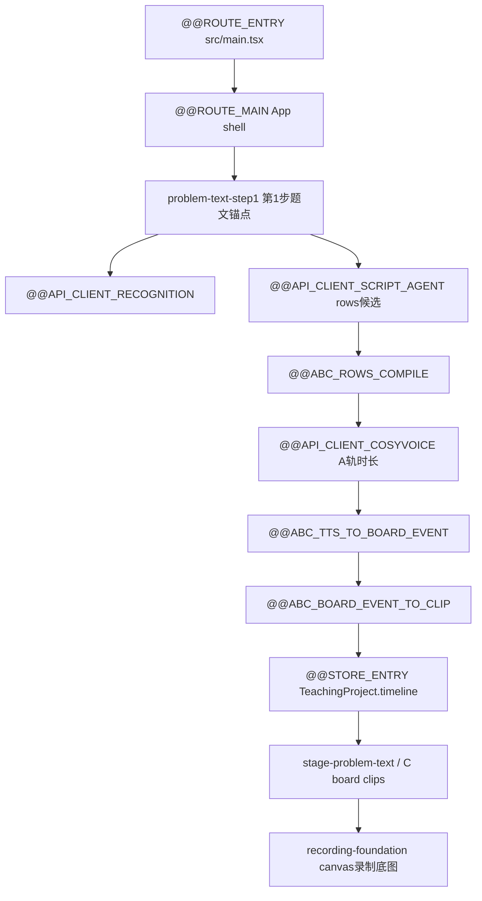

# Core Trace Tags

更新时间：2026-06-07 19:34 +08:00

用途：把核心路由、断点、API、水电链路集中打标签，方便后期 review 用搜索一次拉出整条脉络。

## 搜索入口

- 路由入口：`@@ROUTE_ENTRY`、`@@ROUTE_MAIN`、`@@ROUTE_STANDALONE_*`
- API 水电：`@@API_CLIENT_*`、`@@API_GATEWAY_VITE`、`@@API_GATEWAY_ZEABUR`
- 状态总闸：`@@STORE_ENTRY`、`@@STORE_ACTION_*`
- ABC 转换：`@@ABC_ROWS_COMPILE`、`@@ABC_TTS_TO_BOARD_EVENT`、`@@ABC_BOARD_EVENT_TO_CLIP`
- DOM/录制锚点：`data-agent-anchor="problem-text-step1"`、`data-agent-anchor="stage-problem-text"`、`data-agent-anchor="recording-foundation"`

## 核心路由

| 标签 | 文件 | 含义 |
| --- | --- | --- |
| `@@ROUTE_ENTRY` | `src/main.tsx` | 唯一页面分发点，读取 `?standalone=` |
| `@@ROUTE_MAIN` | `src/main.tsx` -> `src/App.tsx` | 正式主工作台 |
| `@@ROUTE_STANDALONE_C_STICKER` | `src/standalone/CStickerStandalonePage.tsx` | C 贴纸 proof |
| `@@ROUTE_STANDALONE_DRAWBOARD_CORE` | `src/standalone/DrawboardCoreStandalonePage.tsx` | Drawboard 核心 proof |
| `@@ROUTE_STANDALONE_DRAWBOARD_HYBRID` | `src/standalone/DrawboardHybridPrototypePage.tsx` | Hybrid shell prototype |
| `@@ROUTE_STANDALONE_KONVA_PROOF` | `src/standalone/KonvaProofPage.tsx` | Konva content-layer proof |

## API 水电链路

| 标签 | 前端客户端 | Vite 网关 | 触发页/组件 | 写入/输出 |
| --- | --- | --- | --- | --- |
| `@@API_CLIENT_RECOGNITION` | `src/services/recognitionGatewayClient.ts` | `/api/recognition/problem-text` | `ProblemWorkspace` / 图片识别 | 题文候选/确认态 |
| `@@API_CLIENT_SCRIPT_AGENT` | `src/services/scriptAgentGatewayClient.ts` | `/api/agent/script-board` | `AgentReviewCard` / 生成 rows | `scriptAgentCandidateDraft` |
| `@@API_CLIENT_BOARD_LAYOUT_PREVIEW` | `src/services/boardLayoutPreviewGatewayClient.ts` | `/api/agent/board-layout-preview` | `VoiceWorkspace` / 排版预览 | `layoutPreviewDraft` |
| `@@API_CLIENT_COSYVOICE` | `src/services/cosyvoiceGatewayClient.ts` | `/api/tts/cosyvoice/sentences` | `VoiceWorkspace` / 生成 A 轨 | voice assets + timing |

## 三层业务逻辑扫描

### 1. 用户工作流层

```text
题目输入 -> Agent 生成 rows -> 人工确认正式稿 -> 排版预览 / TTS -> 时间线 -> 舞台调整 -> 录屏归档
```

### 2. 数据真相层

```text
TeachingProject.assets(problemText/scriptText/boardLayout/voiceAudio/voiceTiming)
  -> TeachingProject.timeline.tracks/clips
  -> StageCanvasConfig + TimelineClip(kind=board)
```

### 3. 转换与渲染层

```text
rows
  -> @@ABC_ROWS_COMPILE
  -> TTS sentence units
  -> @@ABC_TTS_TO_BOARD_EVENT
  -> @@ABC_BOARD_EVENT_TO_CLIP
  -> @@STORE_ENTRY
  -> DrawboardStage / AutoHandwritingLayer / CanvasRecordingSurface
```

## SOP



## 边界

- 标签只做追踪，不改变运行逻辑。
- 新 API、路由、状态 action 必须补同类标签。
- 不允许把本地绝对路径写进代码标签；环境事实只放 `scripts/continuity-stack.config.json` 或项目文档。