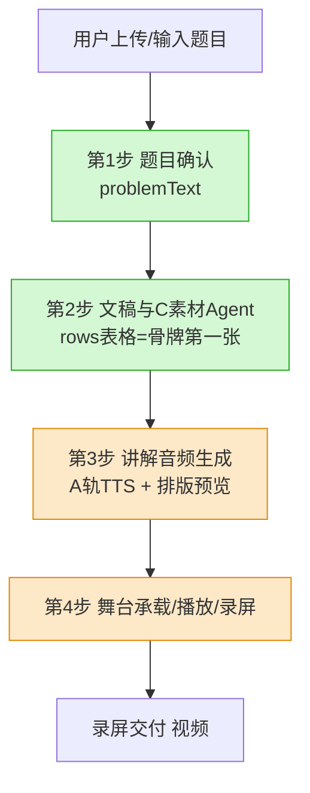
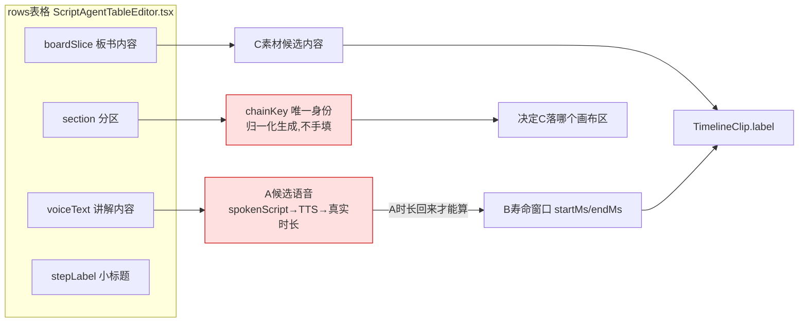
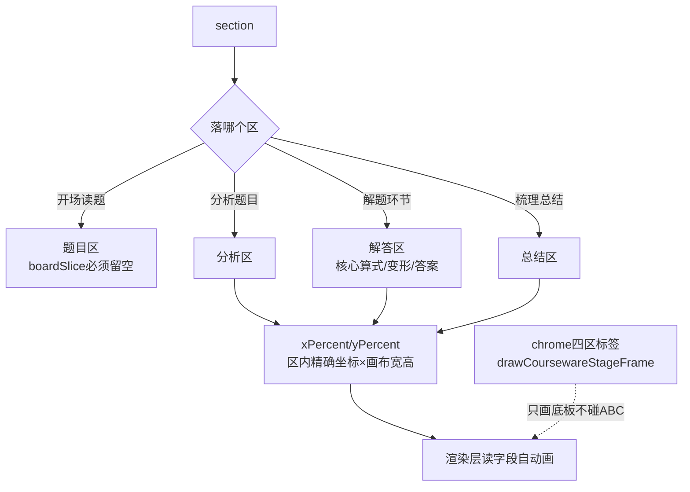

# 认知图 · 核心逻辑动态图

> 性质：结构脑图 / 核心逻辑 / 动态维护（看一点补一点，不是流水账）
> 规则：这张图装"藏在里面的东西"——字段贯穿、时序、边界。每次走读新一段就补图，标 ✅已实证 / ⏳待走读。
> 配套：时间线看 `历史/CHANGE_TREE变更树.md`；状态/病灶看 `真相路标-当前唯一入口.md`。
> 元规矩：**读线，不许猜。** 这套设计每个字段都有用意，想当然=必错。

---

## ☢️☢️☢️ 绝对不可混淆区 Σ(っ°Д°;)っ 可怕！！！（熊孩子最爱搞乱这里）

> 这一整区是夏夏一次次掰熊孩子掰出来的血泪。每一条都是"看起来能跑、其实已拧断"的雷。
> 动这些之前，先在这里对一遍。混了任何一条 = 整条链塌 = 夏夏又要哭。**先停，问夏夏。**

### 🚨①【数学符号：耳朵 ≠ 眼睛，两条路死分开】
```
同一个  18÷(3+3)×2  喂给两个地方，转义完全不同：

   👂 耳朵路(语音)          👁️ 眼睛路(板书显示)
   aliyunMathSpeechText.ts   boardTextDisplayRoute.ts
   ÷ → "除以"  × → "乘以"     简单式→C手写字体 / 复杂式→KaTeX
   目的:阿里云读对             目的:画对
        ╲                         ╱
         ╲   ☢️ 禁止用一个       ╱
          ╲  hasBoardMath 布尔  ╱
           ╲ 同时决定这两条！  ╱
```
- ☢️ `$...$` 是语音(A/TTS)的保护外壳，**不许越权决定 C 显示字体**。显示前必须 `stripSimpleBoardMathDelimiters` 剥掉。
- 血泪史：变更树 `2026-05-06 拆出C板书显示路由防止A保护越权`——被搞乱过又修回来。
- 边界：耳朵归 `speechText/`，眼睛归 `boardSticker/`，两个模块，绝不共用一个布尔。

### 🚨②【候选态 ≠ 正式态，确认才入正式】
```
对话/表格里改的 = 候选态(scriptAgentCandidateDraft, 有缓存,关不丢,可反复改)
        ↓ 只有点「确认应用到正式稿」才过门
正式态(scriptText / boardLayout)
```
- ☢️ 禁止候选直接当正式用；禁止用空 draft 覆盖已有候选缓存（变更树 2026-05-19 有护栏）。

### 🚨③【ABC 三层职责，谁都不许越权】
```
A 语音 = 主时钟(唯一时间真相)   B 寿命窗口 = 靠A真实时长算,不自己造时间
C 画布演员 = 内容/站位/演绎      金手指 = overlay人工补救,永不写ABC base
```
- ☢️ B 不许凭空定时间，必须等 A 的逐句 json 回来按 row 入轨。
- ☢️ 金手指只写 overlay 层，**绝不写 base**（换框架也不变）。

### 🚨④【chrome ≠ zone ≠ C演员，三个不同概念别混】
```
chrome = 系统字体外壳(四区标签:题目/分析/解答/总结) 只画底板,不碰ABC数据
zone   = 纯CSS布局类名(zone-card/zone-stage)
C演员  = 手写板书内容(读字段渲染)
```
- ☢️ chrome/zone 是真概念，不是噪声，**禁止当垃圾删**（被熊孩子误伤过，已平反）。

### 🚨⑤【框架替换：只换主舞台，分层换不整包推】
```
✅不动:金手指(原生canvas)/C逐笔(CSS reveal)/录屏三层契约
❌只换:主舞台承载 tldraw → Konva
```
- ☢️ 谁要整包重写 = 代码写乱的根源（详见"四之B框架决策线"）。先停，问夏夏。

---

## 〇、Agent-C 控制元件谱 🗡️（修仙式法器库 · 一路走一路收集）

> 玩法：这趟探秘 = 给最终的「Agent-C 控制系统」集齐控制元件。每走通一环，收一件入库。
> 每件标清：元件名 / 给什么能力 / 在哪（代码位置）/ agent 怎么用。集齐 = agent 能完整操控 C。
> 状态：🟢已收集实证 / 🟡见到待实证 / ⚪听说待寻

| 元件 | 给什么能力 | 在哪 | agent 怎么用 | 状态 |
| --- | --- | --- | --- | --- |
| **rows 切片表** | C 内容的源头（骨牌第一张） | `scriptAgentTable/ScriptAgentTableEditor.tsx` | 写 section/boardSlice/voiceText | 🟢 |
| **归一化关口** | 脏输入→统一格式（别名容错、剥旧标签） | `normalizeScriptAgentTableDraft.ts` | 按标准字段读写，不写`<br>/<b>` | 🟢 |
| **手工编辑** | 客户不满意时直接增删改 | `ScriptAgentTableEditor` onChange/addRow/deleteRow/moveRow | 改单元格/插行/删行/移序 | 🟢 |
| **section 分区** | 决定 C 落哪个画布区（题目/分析/解答/总结） | rows.section → chainKey | 写四区之一 | 🟢 |
| **chainKey 身份** | A/B/C 唯一身份锚（错一个全乱） | `abcChain/abcChainKey.ts` createRowChainKey | 不手填，由 section 自动算 | 🟢 |
| **boardSlice** | C 写什么内容 | rows.boardSlice → C素材候选 | 填板书核心内容 | 🟢 |
| **voiceText** | A 这句怎么讲 | rows.voiceText → spokenScript → TTS | 填口播文稿 | 🟢 |
| **候选态缓存** | 关面板不丢、可反复改、确认才入正式 | store scriptAgentCandidateDraft | 重生成/手改，满意才"确认应用" | 🟢 |
| xPercent/yPercent | C 在区内精确站位 | TimelineClip | 写百分比坐标 | 🟡 |
| widthPercent/fontSize | C 多宽/多大 | TimelineClip | 写数值 | 🟡 |
| drawSpeed | C 逐笔多快（像真人写） | TimelineClip + boardReveal | 写速度值 | 🟡 |
| revealStartMs/EndMs | C 何时开始/写完显现 | TimelineClip | 写时间窗 | 🟡 |
| B 寿命窗口 startMs/endMs | C 何时出现/消失（由A时长生成） | timeline-factory | 不直接写，靠A时长算 | ⚪ |
| 金手指 overlay | 人工补救层（不写base） | GoldenFingerCanvasLayer | overlay 画笔 | ⚪ |
| 录屏三层 base/content/overlay | 交付出片 | stageRecorder/useCanvasRecorder | 合成录制 | ⚪ |

> 集齐进度：核心控制元件（内容+身份+格式+编辑）🟢已收集；演绎/站位元件 🟡见到待实证；时序/金手指/录屏 ⚪待寻。

---

## 一、全链总览（用户上传 → 录屏出片）


- ✅ 第1-2步：已走读实证，链路通，字段与文档咬合。
- ⏳ 第3-4步：待继续走读（音频生成细节 / 舞台渲染 / 录屏）。

---

## 二、骨牌第一张：rows 表格字段 → 下游（✅已实证）


- 🔑 时序铁律：**C内容先定，B寿命窗口必须等A语音真实时长回来。A是主时钟。**（藏在编译逻辑里，看页面看不出）
- 🔑 chainKey 是隐藏的唯一身份，错一个整张画布乱。

---

## 二之B、手工编辑表格 + 字段格式规范（✅已实证 · 🔑 以后 agent 抓取必遵守）

> 用途：客户不满意 agent 生成的内容时，**直接在右侧表格手工增删改**。
> 关键：这里的字段格式必须统一，因为以后 agent 要抓这些节点。归一化关口已做好兜底。

### 手工编辑入口（ScriptAgentTableEditor.tsx）
| 操作 | 实现 | 出口 |
| --- | --- | --- |
| 改单元格 | `onChange → updateRow(rows, i, {字段})` | 统一走 `onChange(rows)` |
| 增行 | `handleAddRow(afterIndex)` 任意行后插入 | 同上 |
| 删行 | `deleteRow(rows, i)` | 同上 |
| 上/下移 | `moveRow(rows, i, i±1)` | 同上 |

### 字段格式规范（normalizeScriptAgentTableRows = 统一关口）
agent / 客户随便填 → 归一化关口 → 统一格式输出。这是 agent 抓取的标准：

| 标准字段 | 能识别的别名（agent 用别的词也归位） | 清洗规则 |
| --- | --- | --- |
| `section` | 环节 / 分类 / 模块 | 归一化空白 |
| `stepLabel` | step_label / step / title / 步骤 / 步骤名称 / 标题 | 归一化空白 |
| `boardSlice` | board_slice / boardText / board_text / 板书 / 板书内容 / 板书贴片 / 写什么 | 归一化空白 + **剥 `<br>`/`<b>` 旧标签** |
| `voiceText` | voice_text / spokenText / spoken_text / 口播 / 口播文稿 / 讲解稿 / 文稿 | 归一化空白 + 剥旧标签 |
| `id` | rowId / row_id / 编号 | 无则自动 `row-{序号}` |
| `chainKey` | （不接受手填） | 由 `createRowChainKey` 归一化时自动算 |

清洗规则细节：
- `normalizeWhitespace`：`\r\n→\n`、`\r→\n`、多空格/Tab→单空格、trim。
- `stripLegacyTags`：剥 `<br>`→空格、剥 `<b></b>`→空。**agent 和用户不手写 `<br>/<b>/Markdown 分段`**。
- 过滤空行：`voiceText / boardSlice / stepLabel` 全空的行直接丢弃。

> 🔑 给 agent 的规矩（提早统一）：抓表格时按"标准字段"读；写表格时用标准字段名；不写旧标签；身份只看 chainKey（不手填）。

---

## 三、C 分片 → 画布区域（✅已实证）


- section 定区（四选一），xy 定区内坐标——**两层定位**。
- chrome = 外壳（系统字体标签），C = 演员（手写板书），互不污染。

---

## 四、Agent 画布操纵杆（🎮 以后画布控制只动这些字段，不碰渲染）

| 操纵杆 | 控制什么 |
| --- | --- |
| section | C落哪个区 |
| chainKey | A/B/C唯一身份 |
| boardSlice | C写什么 |
| voiceText | A怎么讲 |
| xPercent/yPercent | C精确站位 |
| widthPercent | C多宽 |
| fontSize | C多大 |
| drawSpeed | C逐笔多快(像真人) |
| revealStartMs/EndMs | C何时显现 |
| startMs/endMs(B) | C何时出现/消失 |

> 核心边界：agent 写字段（数据层）↔ 画布读字段自动呈现（渲染层）。两层解耦。
> 这是 tldraw 退、Konva 上的根本原因：tldraw 的 shape 模型挡着 agent 直接控制这些字段。

---

---

## 四之B、框架决策线 🧭（Konva · 夏夏与阿圆共识 · 防熊孩子整包折腾）

> 决策：主舞台承载层 tldraw → **Konva（react-konva）**。理由：agent 是第一公民（代码直接操控画布，不像 tldraw 要绕 UI）。
> 状态：🟢 方向已共识（夏夏定方向，阿圆认同，DeepSeek 选型分析印证）。

### 🚨 铁律：分层换，不整包推翻（代码写乱就乱在这）
熊孩子不理解这条 → 上来整包重写 → 代码写乱。实证现状：

| 层 | 现状 | 换框架时怎么办 |
| --- | --- | --- |
| 金手指画笔 | ✅ 已是干净原生 canvas2d，不缠 tldraw | **不动**（独立 Stage/canvas 叠加即可） |
| C 逐笔显现 | ✅ AutoHandwritingLayer + CSS clip-path reveal | **基本不动**（Konva 用 clip+tween 同源，按需平移） |
| 录屏三层 | ✅ base/content/overlay 合成契约 | **契约不动**（Konva 渲染在标准 canvas，captureStream/toDataURL 通用） |
| **主舞台承载** | ❌ tldraw 残留（太重、agent 难控） | **只换这一层 → Konva** |

> 核心边界：**只换主舞台承载层；金手指 / C逐笔 / 录屏契约保留。** 这是"覆盖/叠加不侵入"哲学。
> 谁要整包推翻重写 = 违背此线 = 代码写乱的根源，先停下问夏夏。

### Konva 关键优势（对齐本项目）
- agent 程序化逐帧控制：`new Konva.Text({clipWidth:0})` + `Tween` reveal，跟 A 时钟绑定。
- agent 动态增改：`layer.add(node)` / `node.setAttrs()`，agent 是第一公民。
- 金手指：多 Stage 层叠，跟现有独立 canvas 思路一致。
- 录屏：标准 canvas，原生 captureStream/toDataURL 直接用。
- 🔮 未来牌（非今天）：Konva 支持 Node.js 同构，agent 可服务端预渲染——先记，不影响当前决策。

### 待验证点（换之前要确认，不许猜）
- [ ] C 逐笔从 CSS clip-path 平移到 Konva clip+tween，手写体感是否一致
- [ ] 金手指独立 canvas 叠到 Konva Stage 上，坐标对齐
- [ ] 录屏三层合成在 Konva 主舞台下重新接通
- [ ] rows 加「agent 金手指控制字段」要等主舞台 Konva 化后再对齐（见元件谱⚪缺口）

---

## 五、待走读补图区（⏳ 看一点补一点）

- [ ] 第3步：voiceText→TTS→A轨真实时长 的完整链（cosyvoice 网关）
- [ ] 第3步：boardSlice→C素材候选→排版预览（BoardPreviewCard，注意tldraw尾巴）
- [ ] B寿命窗口生成：createBoardEventsFromTtsUnits → mapBoardEventsToTimelineClips
- [ ] 第4步主舞台：LegacyStagePreview→DrawboardStage→AutoHandwritingLayer 渲染链
- [ ] 金手指 overlay 层 + 录屏三层(base/content/overlay)合成
